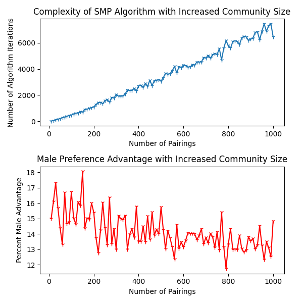
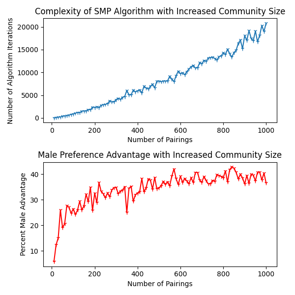

# Stable Marriage Problem

This repo attempts to implement the classic algorithm to the
 [Stable Marriage Problem](https://en.wikipedia.org/wiki/Stable_marriage_problem) and other variants.
 
 More information can be found on my [blog post](https://www.arvarik.com/the-stable-marriage-problem-and-modern-dating).
 
 
### File Structure

* /classic
    * stable_marriage_problem_classic.py
        * This file implements a `Community` object which represents the actors and algorithm in the SMP
    * simulations.py
        * This is the file to execute in order to run some simulations of the algorithm
        * Adjust the values in `main()` to tweak executions of the simulation
        * Executing the code as is should produce the following graph:

    

* /distribution
    * stable_marriage_problem_distribution.py
        * This file implements a `Community` object which represents the actors and algorithm in the SMP, but applies
          a normal/pareto asymmetry in preferences between men/women
    * simulations.py
        * This is the file to execute in order to run some simulations of the algorithm
        * Adjust the values in `main()` to tweak executions of the simulation
        * This is pretty much the same code as the `simulations.py` in the `/classic` package
        * Executing the code as is should produce the following graph:

    

### Future Considerations

* Different distributions and analyzing the asymmetry
    * Currently only the normal/pareto distributions were analyzed
    * How would advantage be affected with different distribution parameters (e.g. Different alpha values for pareto)
    * How would advantage be affected with different distributions entirely (e.g. Poisson)

* "Subgroup" preference
    * As a community grows larger, there are usually smaller subgroups formed (e.g. neighborhoods in Manhattan)
    * With this in mind, we can tweak the preference lists to favor proposals within one's subgroup, even if there are
      more "attractive" people in another subgroup
    * Subgroups would most probably be formed by analyzing the distribution of subgroup populations
        * [Zipf's Law](https://en.wikipedia.org/wiki/Zipf%27s_law)
        * [Rank Size Distribution](https://en.wikipedia.org/wiki/Rank-size_distribution)